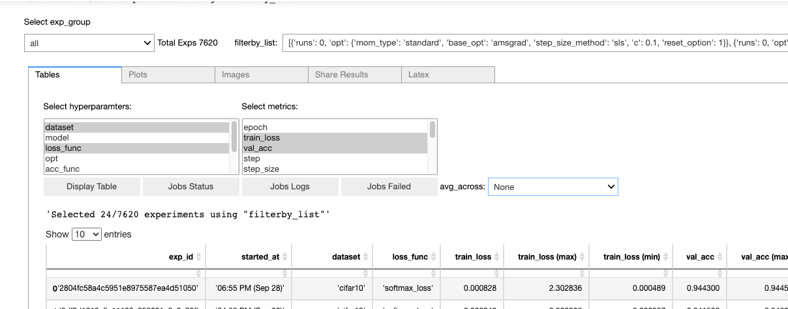

<p align="center" width="100%">
     
</p>

<p align="center">
  Try out the <a href="https://colab.research.google.com/drive/1iqmJWTfsC3Erfay_SwEoUhq_wS4l18Fd?usp=sharing">Google Colab Demo</a> || See <a href="#papers-based-on-haven-ai">Papers that are based on Haven-AI</a>

</p>
<p align="center">
Create a Benchmark with these 4 Steps
</p>
<p align="center">
  <a href="#1-setup-experiments">(1) Setup Experiments</a>|
    <a href="#2-run-experiments">(2) Run Experiments</a>|
  <a href="#3-visualize-experiments">(3) Visualize Experiments</a>|
  <a href="#4-run-experiments-in-cluster">(4) Run Experiments in Cluster</a>
</p>


<table align="center">
  <tr>
    <td>Launch Experiments on Cluster</td>
     <td>Visualize Experiments on Jupyter</td>
  </tr>
  <tr>
    <td valign="top"></td>
    <td valign="top"></td>
  </tr>
    </table>
    


## **Create end-to-end ML projects with the following 4 steps**

### 0 Install
```
pip install --upgrade git+https://github.com/haven-ai/haven-ai
```

### 1. Setup Experiments

Create `trainval.py` file and add the following code,

```python
import tqdm
import os

from haven import haven_examples as he
from haven import haven_wizard as hw

# 1. define the training and validation function
def trainval(exp_dict, savedir, args):
    """
    exp_dict: dictionary defining the hyperparameters of the experiment
    savedir: the directory where the experiment will be saved
    args: arguments passed through the command line
    """
    # 2. Create data loader and model 
    train_loader = he.get_loader(name=exp_dict['dataset'], split='train', 
                                 datadir=os.path.dirname(savedir),
                                 exp_dict=exp_dict)
    model = he.get_model(name=exp_dict['model'], exp_dict=exp_dict)

    # 3. load checkpoint
    chk_dict = hw.get_checkpoint(savedir)

    # 4. Add main loop
    for epoch in tqdm.tqdm(range(chk_dict['epoch'], 10), 
                           desc="Running Experiment"):
        # 5. train for one epoch
        train_dict = model.train_on_loader(train_loader, epoch=epoch)

        # 6. get and save metrics
        score_dict = {'epoch':epoch, 'acc': train_dict['train_acc'], 
                      'loss':train_dict['train_loss']}
        chk_dict['score_list'] += [score_dict]

    hw.save_checkpoint(savedir, score_list=chk_dict['score_list'])
    print('Experiment done\n')

# 7. create main
if __name__ == '__main__':
    # 8. define a list of experiments
    exp_list = [{'dataset':'syn', 'model':'linear', 'lr':lr} 
                 for lr in [1e-3, 1e-4]]
             
    # 9. Launch experiments using magic command
    hw.run_wizard(func=trainval, exp_list=exp_list)
```


### 2. Run Experiments

Run the following command in `terminal`,

```
python trainval.py --reset 1 -v trainval_results.ipynb --savedir_base ../results
```

Optional arguments,

```python
  -h, --help                        show this help message and exit
  -e EXP_GROUP_LIST [EXP_GROUP_LIST ...], --exp_group_list EXP_GROUP_LIST [EXP_GROUP_LIST ...]
                                    Define which exp groups to run. (default: None)
  -sb SAVEDIR_BASE, --savedir_base SAVEDIR_BASE
                                    Define the base directory where the experiments will be saved. (default: None)
  -d DATADIR, --datadir DATADIR     Define the dataset directory. (default: None)
  -r RESET, --reset RESET           Reset or resume the experiment. (default: 0)
  -ei EXP_ID, --exp_id EXP_ID       Run a specific experiment based on its id. (default: None)
  -j RUN_JOBS, --run_jobs RUN_JOBS  Run the experiments as jobs in the cluster. (default: 0)
  -nw NUM_WORKERS, --num_workers NUM_WORKERS
                                    Specify the number of workers in the dataloader. (default: 0)
  -v VISUALIZE_NOTEBOOK, --visualize_notebook VISUALIZE_NOTEBOOK
                                    Create a jupyter file to visualize the results. (default: )
```

### 3. Visualize Experiments

Step 2 creates `trainval_results.ipynb`, open the file on Jupyter to get tables and plots



You can launch Jupyter with,

```bash
jupyter nbextension enable --py widgetsnbextension --sys-prefix
jupyter notebook
```

### 4. Run Experiments in Cluster

If you have access to the ElementAI cluster `api` then you can run the experiments in cluster (slurm option coming soon),

```
python trainval.py --run_jobs 1 --reset 1
```


## Structure

<table>
      <tr>
    <td>Codebase Structure</td>
     <td>Result Folder Structure</td>
  </tr>
      <tr>
    <td valign="top">
          <pre>
project/
├── src/
│   ├── __init__.py
│   ├── datasets.py
│   └── models.py
├── scripts/
│   └── train_on_single_image.py
├── exp_configs.py
├── README.md
└── trainval.py          # a copy of the code
          </pre>
          </td>
    <td valign="top">
           <pre>
results/
├── <exp_id>/
│   ├── code/            # a copy of the code
│   ├── images/          # qualitative results
│   ├── exp_dict.json    # defines the hyperparameters
│   ├── score_list.pkl   # list of scores saved each epoch
│   ├── model.pth        # saved model state
│   └── job_dict.json    # contains the job info
          </pre>
       </td>
  </tr>
 </table>
 
## Papers based on Haven-AI

- COVID19: https://www.elementai.com/news/2020/accelerating-the-creation-of-ai-models-to-combat-covid-19-with-element-ai-orkestrator
- LCFCN: https://github.com/ElementAI/LCFCN
- Embedding Propagation: https://github.com/ElementAI/embedding-propagation
- Bilevel Augmentation: https://github.com/ElementAI/bilevel_augment
- SSN optimizer: https://github.com/IssamLaradji/ssn
- SLS optimizer: https://github.com/IssamLaradji/sls
- Ada SLS optimizer: https://github.com/IssamLaradji/ada_sls
- SPS optimizer: https://github.com/IssamLaradji/sps
- Fish Dataset: https://github.com/alzayats/DeepFish
- Covid Weak Supervision: https://github.com/IssamLaradji/covid19_weak_supervision

## Motivation

- Haven is a library for building, managing and visualizing large-scale reproducible experiments. It helps developers establish a workflow that allows them to quickly prototype a reliable codebase. It also helps them easily  scale that codebase to one that can run, manage, and visualize thousands of experiments seamlessly. 

- The library provides a wide range of functionality including best practices for defining experiments, checkpointing, visualizing and debugging experiments, and ensuring reproducible benchmarks. 

- This library could strongly boost productivity for building great products, winning machine learning competitions, and getting research papers published. 

- The only structure required is that each experiment has the following.
    * `<savedir_base>/<exp_id>/exp_dict.json` that defines a single set of hyperparamters as a python `dict`.
    * `exp_id` is the hash of that hyperparameter python `dict`.
    * `<savedir_base>/<exp_id>/score_list.pkl` that has a list of dicts where each dict contains metrics as keys with scores as their values.


## Expected structure of a Havenized project
```
project/
├── src/
│   ├── __init__.py
│   ├── datasets.py
│   └── models.py
├── scripts/
│   ├── visualize_mnist.py
│   └── train_on_single_image.py
├── exp_configs.py
├── README.md
└── trainval.py
```

## Contributing

We love contributions!
